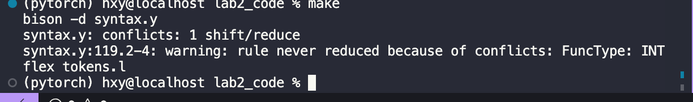

## <center>lab2 语法实验 </center>
#####  <center>黄潇颖 2020201622 </center>

#### 1.实验思路
##### 1.1 基于实验一修改`tokens.l`文件
- 由于要构造树，于是在`%top`部分加上下面部分。其中，syntax.tab.h
  ``` c
  #include "tree.h" 
  #include "syntax.tab.h"
  extern int nodesNum;```
- 本词法分析器会过滤掉注释，与.y文件交流的token均为终结符。在实验1的基础上加上了语法树叶节点（对应终结符）的构造。
- `.l`文件向`.y`文件传递信息依靠的是：
  - 分析出的token后的操作域需要return一个相应的常数值，这些值在`syntax.tab.h`文件中已经生成好了。
  - 通过yyac官方定义的`yylval`入栈。
  
##### 1.2 `syntax.y`文件的实现思路
- 基于sysY语言定义文件中的文法进行一些小的改动，消除移进归约冲突。例如：
  - 直接使用INT和VOID关键字，去掉了`Btype`和`FuncType`的相关文法。首先按照定义文件给出的文法会出现移进归约冲突(见下图);其次因为sysY只有INT类型的元素，我认为不必再为此新添产生式。
    
  - 为含**重复一次到多次子式**的式子增加新的产生式，使得每一块产生式更加简洁。比如拓展新归约项MutiVarDecl使得`VarDecl->BType VarDef { ',' VarDef } ';'`文法在实现时成为`VarDecl:   INT VarDef MutiVarDecl SEMICOLON`。
  

- 在修改文法消除冲突后增添建树相关代码，`.y`文件中主要是对非终结符(中间节点的构造)。
- 全局变量:
    ```c
    TreeNode* tree_root;//树根
    int nodesNum;//统计节点个数，方便生成节点序号
    ```
- 所有的node都是TreeNode*类型的。
  ```c
    %union
    {
    int yint;
    TreeNode* ynode;
    };
  ```
- 符号优先级和结合方向
  直接找了博客照着表格写的<link>https://blog.csdn.net/yuliying/article/details/72898132
  ```c
    %left AND OR  
    %left PLUS MINUS 
    %left MUL DIV MOD
    %right NOT
    %left LPAREN RPAREN LSQUBRAKT RSQUBRAKT

    %nonassoc ELSE IF
    %nonassoc RETURN WHILE
  ```
- 每一个产生式都会New一个新的node,这是为产生式的左项创建的节点，右边的每一个符号都是已经实例化节点了，于是在归约项的节点后将右侧的节点自右向左依次更新归约项的next和child指针。换句话说，树是自低向上建的，每一个节点都维护一个指向直接child和自己在语句中的下一个符号所对应的节点。


##### 1.3 语法树的绘制
- 使用python下`graphviz`包绘制。
- 树节点的结构体,填充了一些一些目前用不到但是猜测lab3会用到的东西，比如位置信息、对int元素进行了处理。
    ```c
    typedef struct node
    {
        int row;
        int col;

        int node_index;
        char symbol[16];
        char string_val[16];
        int int_val;
        int terminal_val;
        struct node *child;
        struct node *Parent;
        struct node *next;
    } TreeNode;
    ```
- 树的构造在前一节已经说明，打印时树的遍历也是自底向上进行的，因而绘制出来的图是反过来的。`tree.h`中`DrawAST`函数即是**递归遍历**构造python绘制语法树需要用到的node name(`STindexfile`文件夹下)和node (`STtextfile`文件夹下) label的信息。
- `drawtree.py`文件实现了包含了读取`STindexfile`和`STtextfile`文件并依此**构造和绘制语法树的类**`DrawASTWithGraphviz`。生成的树**结构信息**以及绘制的**成图**在`tree_pic`文件夹下。

#### 2.运行和实验结果

- `makefile`中的命令:
  `make yacc`:使用bison编译，构造文法分析器。
  `make lex`:使用flex编译，构造此法分析器，因为调用了`.tab.h`文件这一步必须在make yacc之后。
  `make cc`:gcc创建可执行文件。
  `make build`:前三个命令一步到位。
  `make run`:运行text.py文件，对`SysY`文件夹下的6个.sy文件进行分析。
  `make clean`:删除所有输出文件和可执行文件。

- 目前写出的文法无移进归约冲突。
- 生成的语法树位于`lab2_code/tree_pic`文件夹下。

#### 3.不足之处
没有注意常量表达式`ConstExp->AddExp`后的注：使用的Ident必须是常量，此处将在第三部分语义实验中修改。
